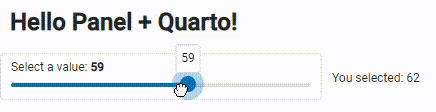
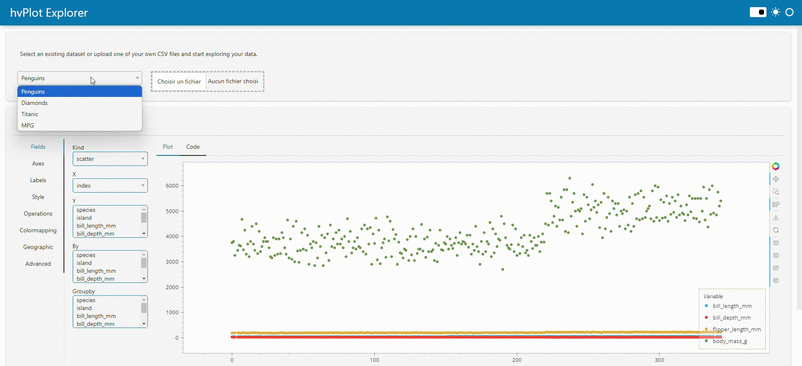
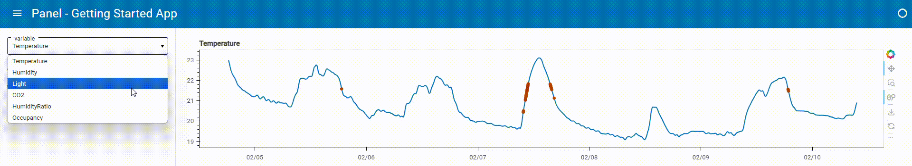

# Dynamic GitHb Pages with Panel
*How do you create interactive and client-side GitHub Pages ? The first stone in an ambitious edifice*
date: 04/10/2024

## Introduction

For several years now, I’ve been dreaming of having a nice portfolio to showcase my projects as a budding data scientist. After almost 1 year of reflection, trials, failures and a few successes, I created my first portfolio on GitHub Pages. Happy with this personal achievement, I wrote an article about it to share the fruit of my research with the community, available [here](https://towardsdatascience.com/full-guide-to-build-a-professionnal-portfolio-with-python-markdown-git-and-github-page-for-66d12f7859f0).

This portfolio was created using the mkdocs python package. Mkdocs is a wonderful package for this kind of project, but with a few shortcomings, the main one being the total lack of interactivity with the reader. The further I got into creating my portfolio, the more frustrated I became by the lack of interactivity. My constraints at the time (still true today) were to have everything executed free of charge and client-side, so the GitHub Pages solution was perfectly suited to my needs.

The further I got into my static portfolio, the more the idea of having a dynamic portfolio system popped into my head. My goal was clear: find a solution to create a reader-interactive portfolio hosted on GitHub Pages. In my research, I found almost no articles dealing with this subject, so I started looking for software, packages and code snippets to address this problem.

The research question guiding this article is: how do I create a dynamic, full-client-side website? My technical constraints are as follows: Use GitHub Pages.

About dashboarding package, I choose to limit myself to Panel from the holoviz suite, because it’s a great package and I’d like to improve my skills with it.

For the purposes of this article, I’ve searched for and found many more or less similar solutions. This article is therefore the first in a series of articles, the aim of which will be to present different solutions to the same research question.

But what’s the point of having dynamic Github pages? GitHub Pages is a very interesting solution for organization/project presentation, 100% hosted by GitHub, free of charge, with minimal configuration and no server maintenance. The ability to include dynamic content is a powerful way of communicating about your organization or project. For data professionals, it’s a very useful solution for quickly generating a dynamic and interesting portfolio.

Holoviz is an exciting and extremely rich set of pacakges. It’s a complete visualization and dashboarding solution, powerful on reasonably sized data and big data. This solution supports all major input data manipulation packages (polars, pandas, dask, X-ray, …), and offers high-level syntax for generating interactive visualizations with a minimum of code. This package also allows you to customize the output and, in particular, to choose your visualization back-end such as pandas (I’ve written [an article](https://medium.com/towards-data-science/the-power-of-pandas-plots-backends-6a08d52071d2) about it if you’d like to find out more). To find out more about this great suite of packages, I suggest [this article](https://towardsdatascience.com/3-ways-to-build-a-panel-visualization-dashboard-6e14148f529d).

## Method

For this job, my technical background imposes a few contingencies:

- I don’t yet know how to code well enough in JavaScript to make complete scripts and write pieces of code directly in JavaScript,
- the dashboarding package will be Panel in order to improve my skills. If the need arises, I won’t rule out repeating the exercise with other dasbhoarding packages (such as Dash, strealint, NiceGUI, etc.). However, this is not my priority.

For this article, my technical environment is as follows:

- python packages: Panel

I use conda and VSCode for my scripts and environment management. Don’t worry if you use other solutions, it won’t have any impact on the rest.

During my research, I identified 3 scripts of varying complexity and visual appeal from my researches, which will serve as good test standards:

- A simple application called ‘simple app’:

```python
import panel as pn  
  
pn.extension(design="material")  
  
slider = pn.widgets.IntSlider(name="Select a value", value=10, start=0, end=100)  
pn.Column(  
    "# Hello Panel + Quarto!",  
    pn.rx("You selected: {}").format(slider),  
).servable()
```

[Source](https://awesome-panel.github.io/holoviz-quarto/getting-started.html)

- A more complex application called ‘big app’:

```python
import io  
import panel as pn  
import pandas as pd  
import hvplot.pandas  
  
pn.extension(template='fast')  
  
pn.state.template.title = 'hvPlot Explorer'  
  
upload = pn.widgets.FileInput(name='Upload file', height=50)  
select = pn.widgets.Select(options={  
    'Penguins': 'https://raw.githubusercontent.com/mwaskom/seaborn-data/master/penguins.csv',  
    'Diamonds': 'https://raw.githubusercontent.com/mwaskom/seaborn-data/master/diamonds.csv',  
    'Titanic': 'https://raw.githubusercontent.com/mwaskom/seaborn-data/master/titanic.csv',  
    'MPG': 'https://raw.githubusercontent.com/mwaskom/seaborn-data/master/mpg.csv'  
})  
  
def add_data(event):  
    b = io.BytesIO()  
    upload.save(b)  
    b.seek(0)  
    name = '.'.join(upload.filename.split('.')[:-1])  
    select.options[name] = b  
    select.param.trigger('options')  
    select.value = b  
      
upload.param.watch(add_data, 'filename')  
  
def explore(csv):  
    df = pd.read_csv(csv)  
    explorer = hvplot.explorer(df)  
    def plot_code(**kwargs):  
        code = f'```python\n{explorer.plot_code()}\n```'  
        return pn.pane.Markdown(code, sizing_mode='stretch_width')  
    return pn.Column(  
        explorer,  
        '**Code**:',  
        pn.bind(plot_code, **explorer.param.objects())  
    )  
  
widgets = pn.Column(  
    "Select an existing dataset or upload one of your own CSV files and start exploring your data.",  
    pn.Row(  
        select,  
        upload,  
    )  
).servable()    
  
output = pn.panel(pn.bind(explore, select)).servable()  
  
pn.Column(widgets, output)
```

[Source](https://panel.holoviz.org/getting_started/build_app.html)

- A dashboard using the ‘Material’ Panel Template, which I call ‘material dasbhoard’:

```python
import hvplot.pandas  
import numpy as np  
import pandas as pd  
import panel as pn  
  
PRIMARY_COLOR = "#0072B5"  
SECONDARY_COLOR = "#B54300"  
CSV_FILE = (  
    "https://raw.githubusercontent.com/holoviz/panel/main/examples/assets/occupancy.csv"  
)  
  
pn.extension(design="material", sizing_mode="stretch_width")  
  
@pn.cache  
def get_data():  
  return pd.read_csv(CSV_FILE, parse_dates=["date"], index_col="date")  
  
data = get_data()  
  
data.tail()  
  
def transform_data(variable, window, sigma):  
    """Calculates the rolling average and identifies outliers"""  
    avg = data[variable].rolling(window=window).mean()  
    residual = data[variable] - avg  
    std = residual.rolling(window=window).std()  
    outliers = np.abs(residual) > std * sigma  
    return avg, avg[outliers]  
  
  
def get_plot(variable="Temperature", window=30, sigma=10):  
    """Plots the rolling average and the outliers"""  
    avg, highlight = transform_data(variable, window, sigma)  
    return avg.hvplot(  
        height=300, legend=False, color=PRIMARY_COLOR  
    ) * highlight.hvplot.scatter(color=SECONDARY_COLOR, padding=0.1, legend=False)  
  
get_plot(variable='Temperature', window=20, sigma=10)  
  
variable_widget = pn.widgets.Select(name="variable", value="Temperature", options=list(data.columns))  
window_widget = pn.widgets.IntSlider(name="window", value=30, start=1, end=60)  
sigma_widget = pn.widgets.IntSlider(name="sigma", value=10, start=0, end=20)  
  
bound_plot = pn.bind(  
    get_plot, variable=variable_widget, window=window_widget, sigma=sigma_widget  
)  
  
widgets = pn.Column(variable_widget, window_widget, sigma_widget, sizing_mode="fixed", width=300)  
pn.Column(widgets, bound_plot)  
  
pn.template.MaterialTemplate(  
    site="Panel",  
    title="Getting Started App",  
    sidebar=[variable_widget, window_widget, sigma_widget],  
    main=[bound_plot],  
).servable();
```

[Source](https://panel.holoviz.org/getting_started/build_app.html)

To meet my goal of deploying both web and GitHub Pages, I will test the deployment of each of the :

- on a local python server, generated using `python -m http.server`,
- GitHub Pages.

### Visualize the optimal operation that dasbhoard should have

Before I start testing, I need to have a benchmark of how each application should work in a perfect world. To do this, I use the local emulation function of the :

```bash
panel serve simple_app.py --dev
```

Explanation:

- `panel serve simple_app.py` : visualiaze the dashboard
- ` — dev` : reload the dashboard each time the underlying files are modified (may require installation of one or more other packages, in particular to track whether or not the underlying files have been modified)

Here is the expected result:

- The simple app :


Simple app visualization, Image is by the author

- The big app :


Big app visualization, Image is by the author

- The material dasbhoard :


Material dashboard visualization, Image is by the author

These visualizations will enable me to see if everything is running smoothly and within reasonable timescales during my deployment tests.

## Results

### First step : transform python script to HTML interactive script

The Panel package transforms a panel application python script into an HTML application in 1 line of code:

```bash
panel convert simple_app.py --to pyodide-worker --out docs
```

Explanation:

- `panel convert` : python script conversion panel package command
- `simple_app.py` : python script to convert
- ` — to pyodide-worker` : Panel can transcribe the Python application into several types of support that can be integrated into HTML productions. In this article, I focus on the output `pyodide-worker`
- ` — out docs` : output folder for the 2 files (HTML and JavaScript) generated.

In the docs folder (‘ — to docs’ part of the line of code), 2 files with the same name as the python script and the extensions ‘html’ and ‘js’ should appear. These scripts will enable us to integrate our application into web content. This code conversion (from python to HTML to JavaScript) is made possible by WebAssembly. Pyodide is a port of CPython to WebAssembly/Emscripte (more info here: [https://pyodide.org/en/stable/).](https://pyodide.org/en/stable/).)

If you’re not familiar with WebAssembly, I invite you to devour [Mozilla’s article](https://developer.mozilla.org/en-US/docs/WebAssembly) on the subject. I’ll be doing an article on the history, scope and potential impact of WebAssembly, which I think will be a real game changer in the years to come.

### First test: local web server deployment

1. Emulate the local web server with python: `python -m http.server`. This command will return a local URL for your browser to connect to (URL like: 127.0.0.1:8000).

2. Click on the HTML script of our python application

_Information_: when browsing our files via the HTML server, to automatically launch the desired application when we open its folder, title the HTML and JavaScript files ‘index.html’ and ‘index.js’. Example :

```markdown
app/  
|- index.html  
|- index.js
```

When the app folder is opened in the local HTML server, index.html is automatically launched.

Test report for deployment on local html server:

- Simple app:✅
- Big app:✅
- Material Dashboard:✅

After testing each of the 3 applications listed above, this solution works perfectly with all of them, with no loss of speed in loading and using the applications.

### Second test: GitHub Pages deployment

In this article, I’ll quickly go over the configuration part of GitHub Pages on GitHub, as I described it in detail in my [previous article](https://towardsdatascience.com/full-guide-to-build-a-professionnal-portfolio-with-python-markdown-git-and-github-page-for-66d12f7859f0).

1. Warning from step 1: the ‘docs’ file hosting the HTML and JavaScript scripts must be named ‘docs’ and placed at the root of the git repository. These are 2 prerequisites for deploying applications on GitHub Pages. Neither the folder name nor its location can be changed.
2. 2 possibilities :  
    2.a. Rename the app files ‘index.html’ and ‘index.js’, and place them directly in ‘docs’. This solution will open the GitHub Pages of your repository directly on the app,  
    2.b. Create an ‘index.html’ file directly in ‘docs’, and add a path to your application’s HTML file.

Here is the content of ‘index.html’ that I created during my deployment tests:

```html
1. <a href="https://petoulemonde.github.io/article_dynamic_webpages/simple_app_pyodide/simple_app.html">Simple app</a>  
<br/>  
2. <a href="https://petoulemonde.github.io/article_dynamic_webpages/big_app_pyodide/big_app.html">Big app</a>  
<br/>  
3. <a href="https://petoulemonde.github.io/article_dynamic_webpages/material_dashboard_pyodide/material_dashboard.html">Material dashboard</a>
```

Explanation:

- `https://petoulemonde.github.io/`: URL of my portfolio
- `article_dynamic_webpages/`: my working repo for this article
- `simple_app_pyodide/simple_app.html`: HTML folder/application to open. In the repo, the file is stored in **docs**/simple_app_pyodide/simple_app.html, but don’t mention ‘docs’ in the absolute path. Why this difference between the file explorer and the link? GitHub deploys from the docs folder, ‘docs’ is its working root.

3. Push in the remote repo (in my previous example, the ‘article_dynamic_webpages’ repo).

4. In the repo, enable the creation of a github project page. In the configuration page, here’s how to configure the GitHub page:


Configuration for deployment on GitHub Pages, Image is by the author

This is where the ‘docs’ folder is essential if we want to deploy our application, otherwise we won’t be able to enter any deployment branches in ‘master’.

Test report: Deployment on GitHub pages:

- Simple app: ✅
- Big app: ✅
- Material dashboard: ✅

Concerning solution 2.b. : This is a particularly interesting solution, as it allows us to have a static home page for our website or portfolio, and then distribute it to special dynamic project pages. It opens the door to both static and dynamic GitHub Pages, using mkdocs for the static aspect and its pretty design, and Panel for the interactive pages. I’ll probably do my next article on this mkdocs + Panel (pyodide-worker) deployment solution, and I’ll be delighted to count you among my readers once again.

### Problems encountered

The dashboards tested so far don’t distribute to other pages on the site/portfolio, so the only alternative identified is to create a static home page, which redistributes to dashboards within the site. Is it possible to have a site with several pages without using a static page? The answer is yes, because dasbhaords can themselves integrate links, including links to other dashboards on the same site.

I’ve modified the Material app code to add a link (adding `pn.pane.HTML(…)` ):

```python
pn.template.MaterialTemplate(  
  site="Panel",  
  title="Getting Started App",  
  sidebar=[  
    pn.pane.HTML('<a href="127.0.0.1:8000/docs/big_app_pyodide/big_app.html">Big app</a>'), # New line !  
    variable_widget,  
    window_widget,  
    sigma_widget],  
  main=[bound_plot],  
).servable();
```

This adds a link to the application’s side bar:


Material dashboard with link visualization, Image is by the author

While the proof here isn’t pretty, it show that a dashboard can integrate links to other pages, so it’s possible to create a site with several pages using Panel alone — brilliant! In fact, I’m concentrating here on the dasbhoarding part of Panel, but Panel can also be used to create static pages, so without even mastering mkdocs, you can create sites with several pages combining static and dynamic elements.

## Discussion

Panel is a very interesting and powerful package that lets you create dynamic websites easily and hosted on GitHub Pages, thanks in particular to the magic of WebAssembly. The package really lets you concentrate on creating the dasbhoard, then in just a few lines convert that dasbhoard into web content. Coupled with the ease of use of GitHub Pages, Panel makes it possible to rapidly deploy data dashboards.

This solution, while brilliant, has several limitations that I’ve come across in the course of my testing. The first is that it’s not possible to integrate user-editable and executable code. I’d like to be able to let users explore the data in their own way, by sharing the code I’ve written with them so that they can modify it and explore the data in their own way.  
The second and final limitation is that customizing dashboards is not as easy as creating them. Hvplot offers, via the _explorer_ tool, a visual solution for exploring data and creating charts. But once in the code, I find customization a little difficult. The packge is awesome in terms of power and functionality, and I’m probably still lacking a bit of skill on it, so I think it’s mainly due to my lack of practice on this package rather than the package itself.

If you’ve made it this far, thank you for your attention! Your comments on my previous article were very helpful. Thanks to you, I’ve discovered Quarto and got some ideas on how to make my articles more interesting for you, the reader. Please leave me a comment to tell me how I could improve my article, both technically and visually, so that I can write an even more interesting article for you next time.

Good luck on your Pythonic adventure!  
Pierre-Etienne